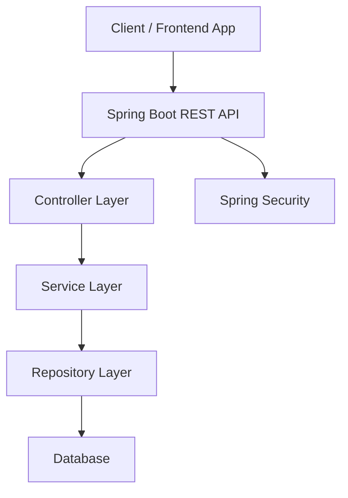
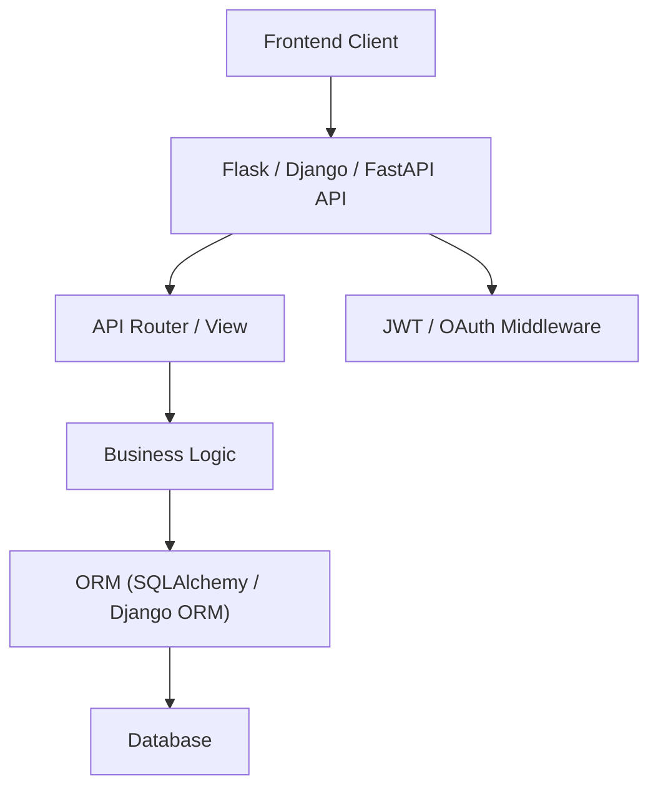
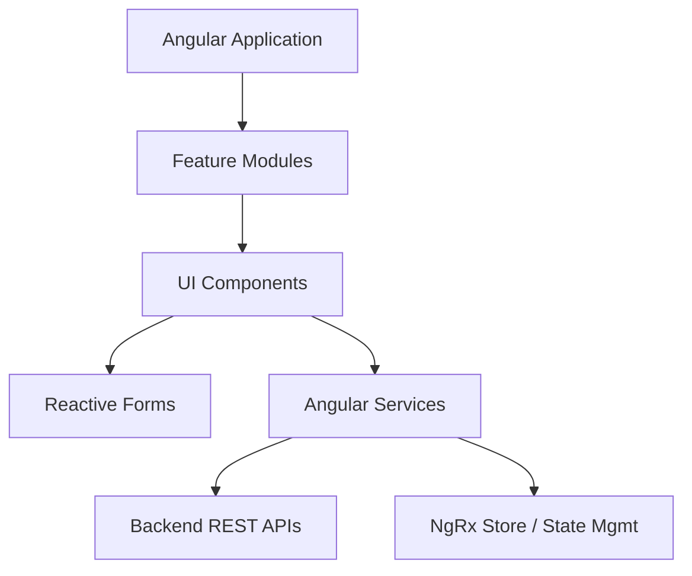
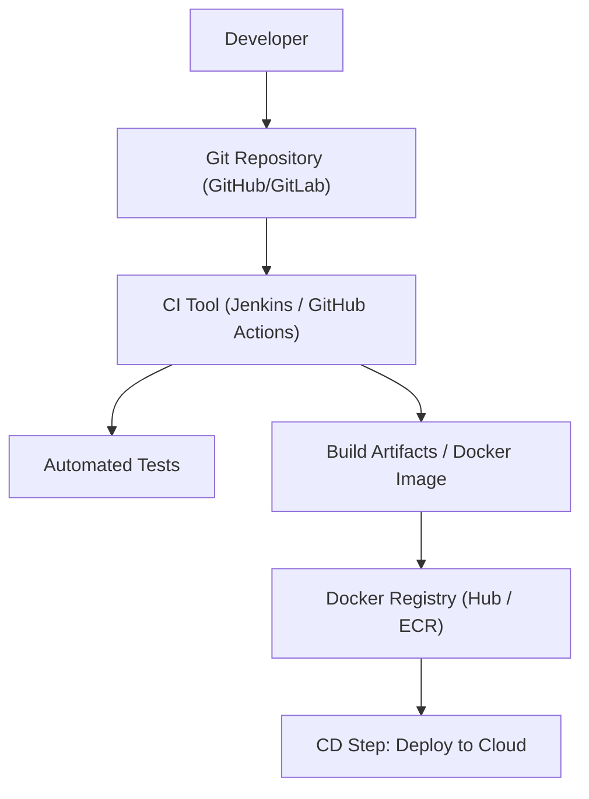
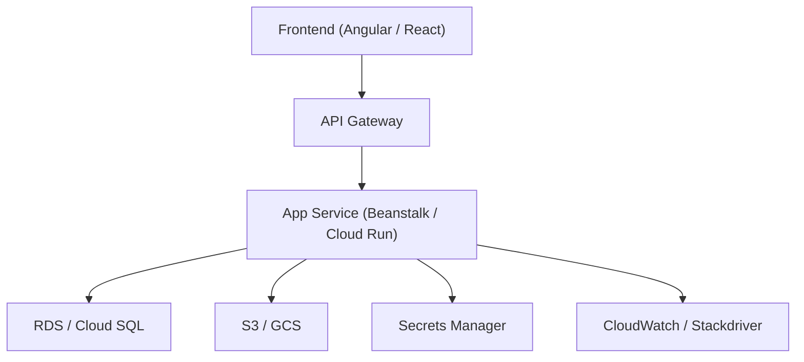

## ✅ 1. **Java & Spring Boot Architecture**

---

## ✅ 2. **Python Backend (Flask / Django / FastAPI)**

---

## ✅ 3. **Angular Frontend Architecture**

---

## ✅ 4. **DevOps & CI/CD Flow**

---

## ✅ 5. **Cloud (AWS / GCP) Microservice Deployment**

