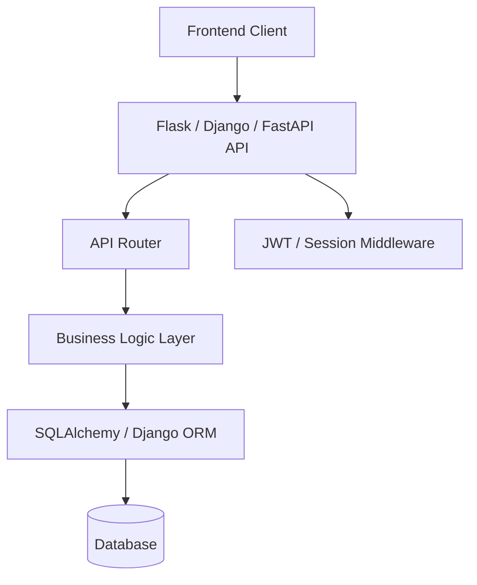

## ✅ 1. **Java & Spring Boot**

### 🔧 **Frameworks**

* **Spring Boot**: Rapidly build microservices with auto-configuration.
* **Spring MVC**: REST controller architecture.
* **Spring Security**: JWT, OAuth2, RBAC.
* **Spring Data JPA**: Data layer abstraction using Hibernate.
* **Actuator**: Health, metrics endpoints.

### 🏗️ **Architecture**

* Layered + Microservice-based

  * Controller → Service → Repository → DB
  * Each service is independently deployable

### 📊 **Diagram (Mermaid)**

```mermaid
graph TD
  UI[UI or Client App]
  UI --> API[Spring Boot REST API]
  API --> Controller
  Controller --> Service
  Service --> Repo[Repository (Spring Data JPA)]
  Repo --> DB[(Database)]
  API --> Auth[Spring Security]
```

---

## ✅ 2. **Python Backend (Flask / Django / FastAPI)**

### 🔧 **Frameworks**

* **Flask**: Lightweight, modular
* **Django**: Full-stack with ORM, admin, auth
* **FastAPI**: Async, type-safe APIs
* **SQLAlchemy / Django ORM**: Database abstraction
* **PyJWT / OAuthlib**: Auth
* **pytest / unittest**: Testing

### 🏗️ **Architecture**

* MVC / MVT for Django
* Flask/FastAPI use Blueprint or Router-based micro-architecture

### 📊 **Diagram (Mermaid)**



---

## ✅ 3. **Angular Frontend**

### 🔧 **Frameworks & Libraries**

* **Angular**: SPA with Typescript
* **RxJS**: Async data streams
* **NgRx**: Redux-like state management
* **Angular Material**: UI components
* **Form Modules**: Reactive & Template-driven forms

### 🏗️ **Architecture**

* Component-based with DI (Dependency Injection)
* Services handle API + business logic
* Module system for scalability

### 📊 **Diagram (Mermaid)**

```mermaid
graph TD
  App[Angular App]
  App --> Module[Feature Modules]
  Module --> Comp[Components]
  Comp --> Form[Reactive Forms]
  Comp --> Service[Service]
  Service --> API[REST API (HttpClient)]
  Service --> State[NgRx Store]
```

---

## ✅ 4. **DevOps & CI/CD**

### 🔧 **Tools**

* **Jenkins**: CI pipelines
* **GitHub Actions**: Lightweight CI/CD
* **Docker / Docker Compose**: Containerization
* **Ansible / Terraform**: Infra as code
* **Kubernetes (optional)**: Orchestration
* **SonarQube, JUnit, Pytest**: Test automation

### 🏗️ **Architecture**

* Trigger-based CI/CD

  * Code push → Build → Test → Deploy
  * Use of containerized apps

### 📊 **Diagram (Mermaid)**

```mermaid
graph TD
  Dev[Developer]
  Dev --> Git[Git Push]
  Git --> CI[CI Pipeline (Jenkins / GitHub Actions)]
  CI --> Test[Run Tests]
  CI --> Build[Build Docker Image]
  Build --> Registry[Docker Registry]
  Registry --> CD[CD Step: Deploy to Cloud]
```

---

## ✅ 5. **Cloud (AWS / GCP)**

### 🔧 **Key Services**

* **Compute**: EC2 / GCE / Lambda / Cloud Run
* **Storage**: S3 / GCS
* **Secrets**: Secrets Manager / SSM / GCP Secret Manager
* **IAM**: Identity & Role-based permissions
* **Monitoring**: CloudWatch / Stackdriver
* **Deploy**: Beanstalk, ECS, Cloud Run, Firebase Hosting

### 🏗️ **Architecture**

* 12-factor microservices
* REST API with autoscaling
* Separate secrets/env vars
* Minimal cost strategy

### 📊 **Diagram (Mermaid)**

```mermaid
graph TD
  FE[Frontend (Angular / React)] --> APIGW[API Gateway]
  APIGW --> API[App Service (Elastic Beanstalk / Cloud Run)]
  API --> DB[(RDS / Cloud SQL)]
  API --> Storage[S3 / GCS]
  API --> Secret[Secrets Manager]
  API --> Monitor[CloudWatch / Logging]
```

